# HashPass

## 👥 Miembros del Equipo
| Nombre y Apellidos | Correo URJC | Usuario GitHub |
|:--- |:--- |:--- |
| Iván Tabares Rico | i.tabares.2024@alumnos.urjc.es | ivvaann29 |
| Yago Contreras Nevares | y.contreras.2024@alumnos.urjc.es | yagoo-cn |
| Iker Marín López | i.marin.2024@alumnos.urjc.es | IML15 |
| Carlos Javier González Ledo | cj.gonzalezl.2024@alumnos.urjc.es | k4r0n22 |

---

## 🎭 **Preparación: Definición del Proyecto**

### **Descripción del Tema**
HashPass es Password Manager diseñado para proteger los credenciales de los usuarios. El objetivo principal es almacenar y organizar credenciales bajo un cifrado robusto.

### **Entidades**
Indicar las entidades principales que gestionará la aplicación y las relaciones entre ellas:

1. **[Entidad 1]**: Usuario
2. **[Entidad 2]**: Credencial (Contraseña)
3. **[Entidad 3]**: Plan (Suscripción)
4. **[Entidad 4]**: Registro de Actividad (Log)

**Relaciones entre entidades:**
- Un **Usuario** puede tener muchas **Credenciales** (1:N).
- Un **Usuario** tiene asignado un único **Plan** activo (1:1).
- Un **Usuario** genera múltiples **Registros de Actividad** (1:N).

### **Permisos de los Usuarios**
Describir los permisos de cada tipo de usuario e indicar de qué entidades es dueño:

* **Usuario Anónimo**: 
  - Permisos: Visualización de la Landing Page, consulta de Planes de precios, acceso a Login y Registro.
  - No es dueño de ninguna entidad.

* **Usuario Registrado**: 
  - Permisos: Gestión completa de su Bóveda (Crear, Leer, Editar, Borrar credenciales), gestión de su perfil (avatar, email, contraseña maestra), visualización de su Panel Principal.
  - Es dueño de: Sus **Credenciales** y su **Perfil de Usuario**.

* **Administrador**: 
  - Permisos: Visualización del listado global de usuarios, capacidad para eliminar cuentas, visualización de estadísticas globales del sistema.
  - Es dueño de: Gestión de **Usuarios**.

### **Imágenes**
Indicar qué entidades tendrán asociadas una o varias imágenes:

- **[Entidad con imágenes 1]**: Usuario - Un avatar de perfil personalizado (subido por el usuario o generado por API).
- **[Entidad con imágenes 1]**: Credencial - Icono o logotipo del servicio asociado (ej: Logo de Netflix, Google, etc.).

---

## 🛠 **Práctica 1: Maquetación de páginas con HTML y CSS**

### **Vídeo de Demostración**
📹 **[Enlace al vídeo en YouTube](https://youtu.be/lHgOssbFNRo)**
> Vídeo mostrando las principales funcionalidades de la aplicación web.

### **Diagrama de Navegación**
Diagrama que muestra cómo se navega entre las diferentes páginas de la aplicación:


> En el diagrama se observa la navegación dividida por roles: los usuarios anónimos acceden a las páginas públicas (azul), los registrados gestionan su información en el área privada (amarillo), y los administradores tienen un flujo exclusivo (verde) para la gestión global de usuarios.

### **Capturas de Pantalla y Descripción de Páginas**

#### **1. Página Principal / Home**
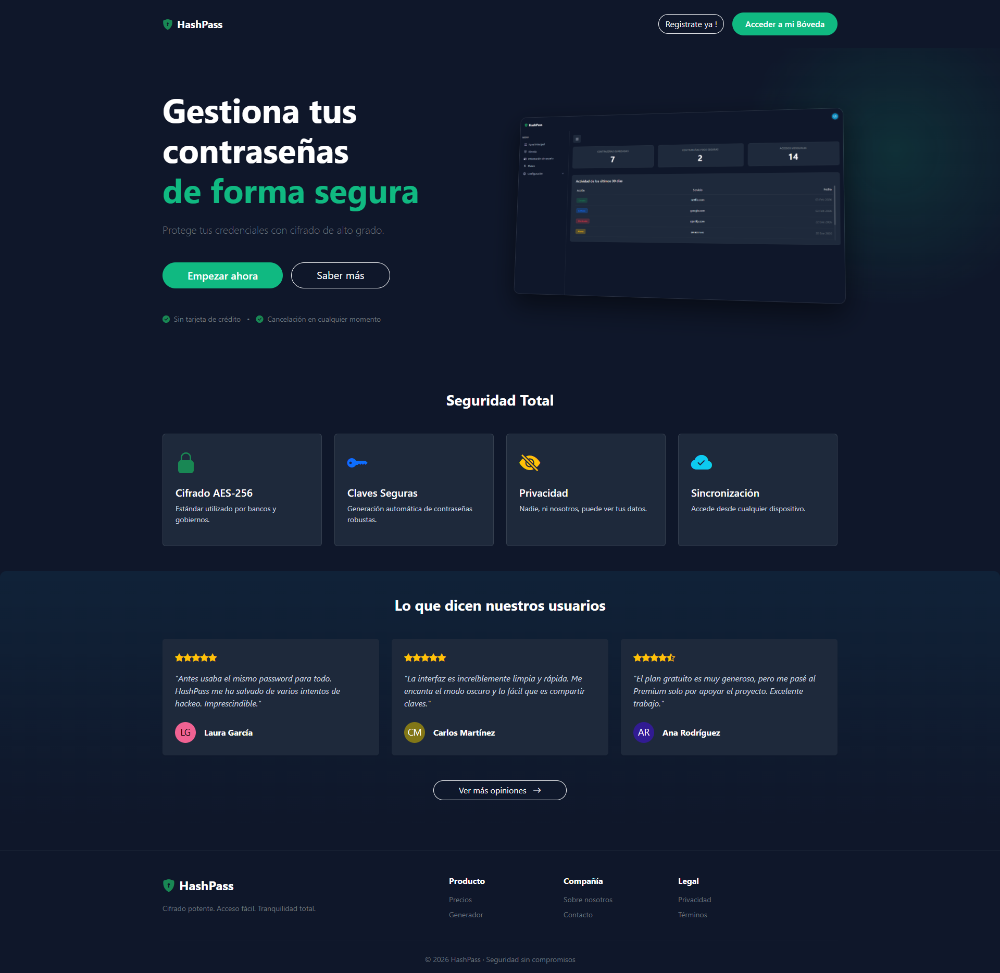

> Página de inicio que muestra la seguridad que ofrece el gestor con una previsualización del perfil de usuario. Incluye botones de navegación como el de los planes y acceso a registro/login para usuarios no autenticados.

#### **2. Planes de Subscripción**
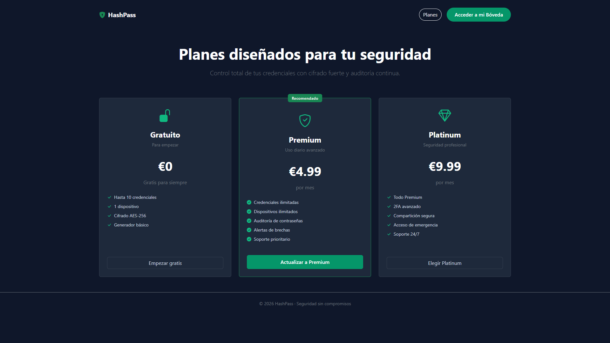

> Vista comparativa de los tres niveles de suscripción (Gratuito, Premium, Platinum).

#### **3. Inicio de sesión - Fase 1**
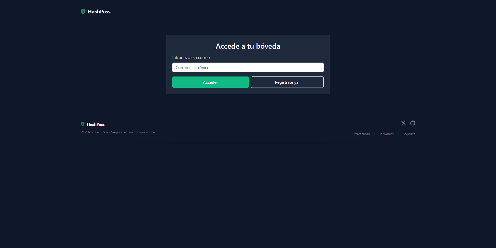

> Paso inicial de la autenticación donde el usuario introduce su correo electrónico para validar su identidad en el sistema.

#### **4. Inicio de sesión - Fase 2**
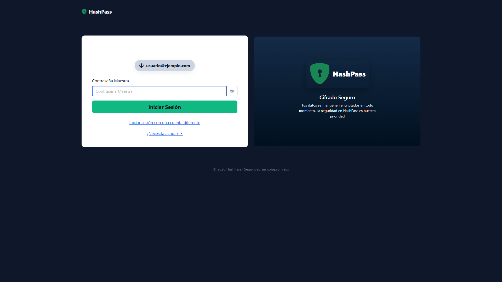

> Segunda fase del login que solicita la Contraseña Maestra para descifrar la bóveda, con ayudas visuales sobre seguridad.

#### **5. Página de Registro**
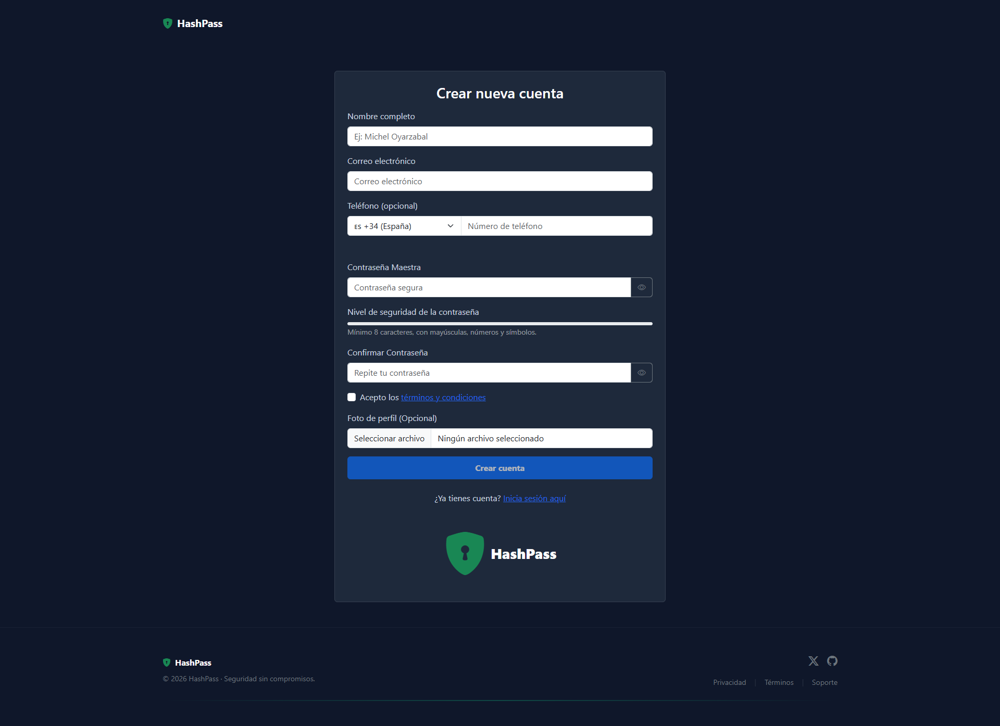

> Formulario de alta para nuevos usuarios que establece las credenciales de acceso y la clave maestra de cifrado.

#### **6. Panel Principal dentro de la sesión**
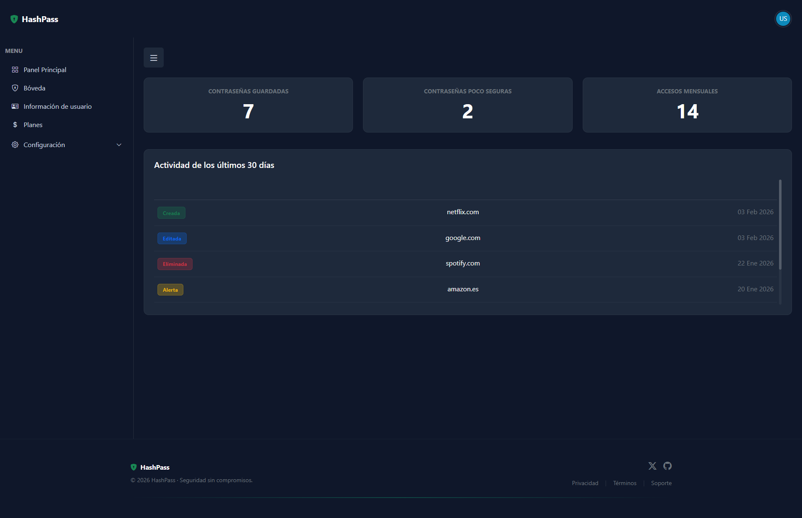

> Centro de control privado con estadísticas de seguridad, historial de actividad reciente y menú lateral de navegación.

#### **7. Bóveda de contraseñas**
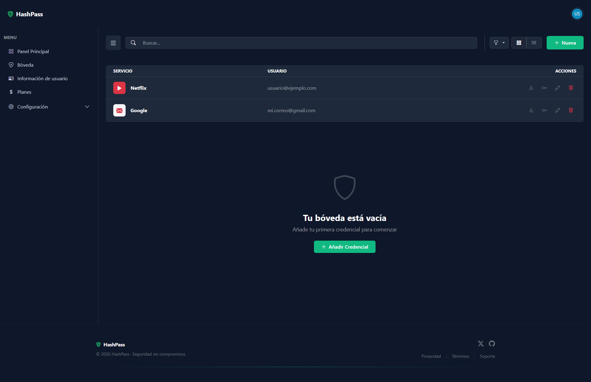

> Listado completo de credenciales con buscador, filtros y botones de acción rápida para copiar datos o editar.

#### **8. Añadir nuevos credenciales**


> Formulario para añadir credenciales con medidor de fortaleza de contraseña en tiempo real y generador de claves aleatorias.

#### **9. Ver info/Editar Credenciales**
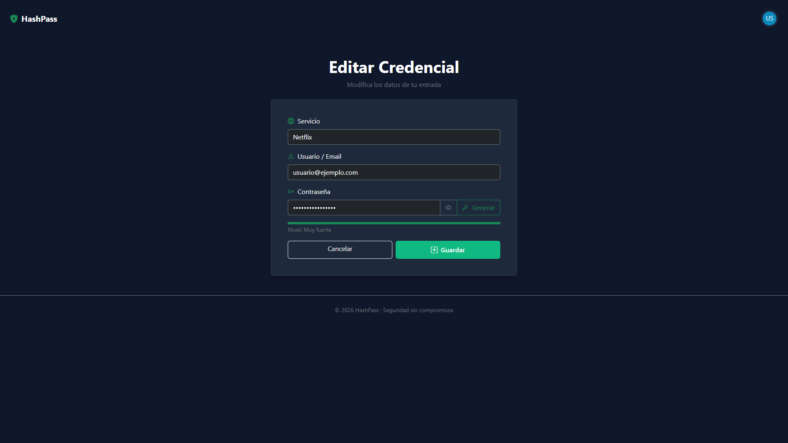

> Vista de detalle que permite visualizar, modificar o eliminar la información de una credencial existente.

#### **10. Info de usuario - Sesión de usuario**
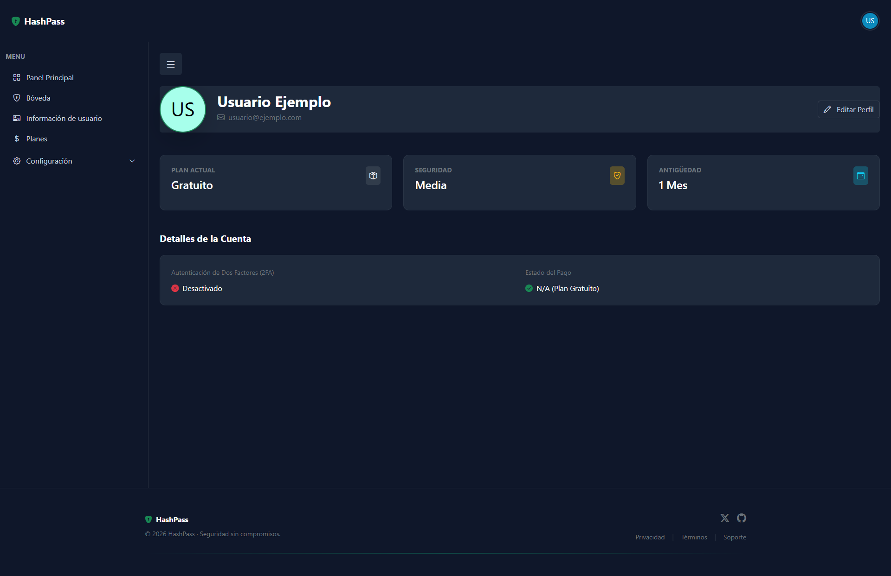

> Ficha de perfil integrada en la navegación que muestra información personal y el estado de la cuenta del usuario.

#### **11. Configuración Básica de usuario**
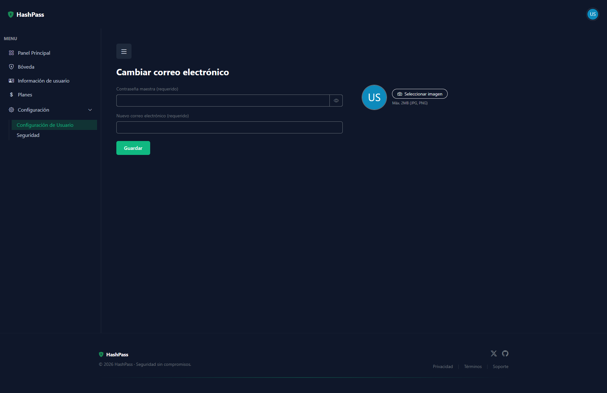

> Formulario de gestión de perfil para actualizar datos personales como avatar y correo electrónico.

#### **12. Configuración de seguridad de usuario**
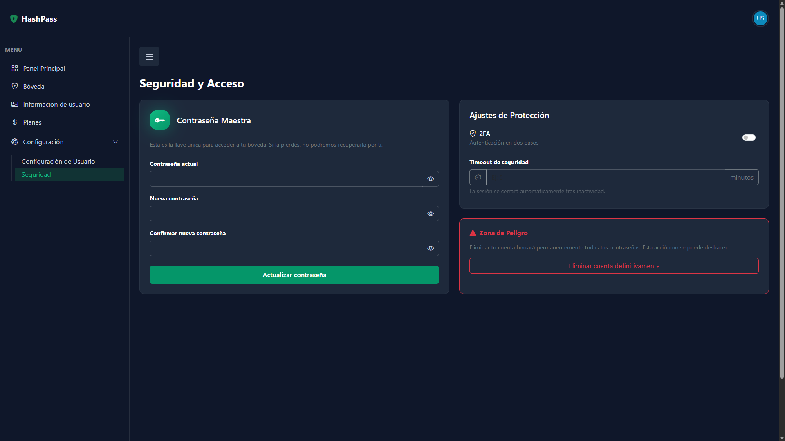

> Panel crítico para cambiar la Contraseña Maestra, activar el doble factor (2FA) o eliminar la cuenta.

#### **13. Página de Administrador**
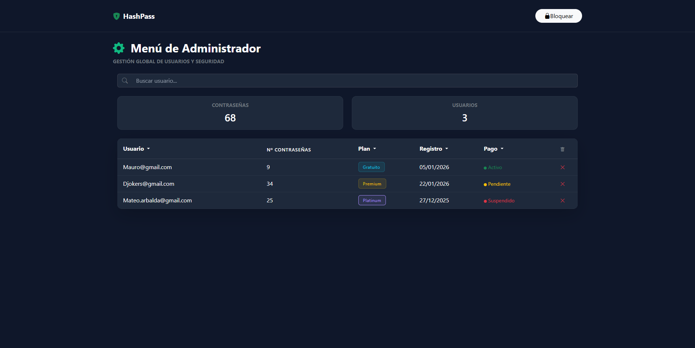

> Panel de gestión global con métricas del sistema y tabla de administración para filtrar y moderar usuarios.

#### **14. Info de usuario - Sesión de admin**
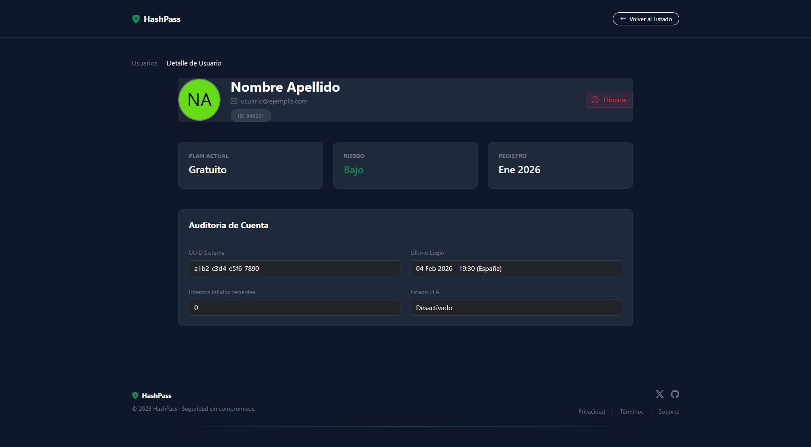

> Vista técnica de un usuario para que el administrador gestione bloqueos sin acceder a la sesión personal.

#### **15. Reseñas y Comentarios**
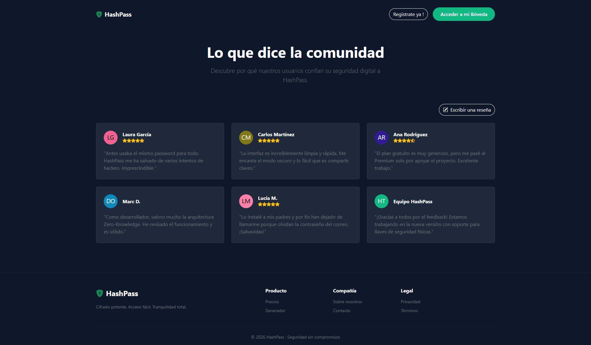

> Sección de comentarios donde se pueden añadir reseñas.

#### **16. Página de Pago**
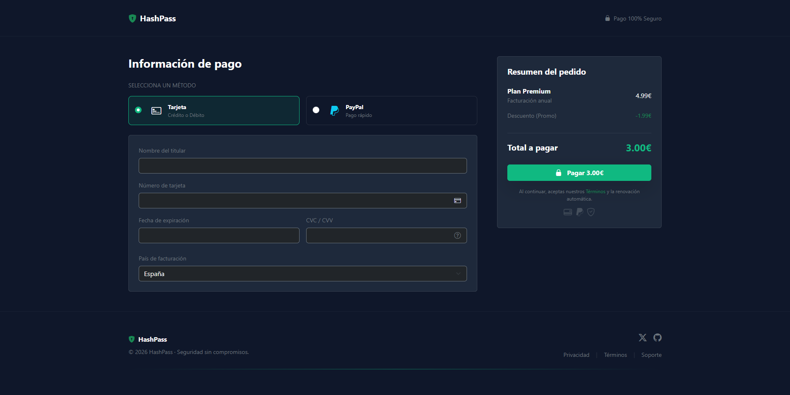

> Pantalla de Pago con targeta

### **Participación de Miembros en la Práctica 1**

#### **Alumno 1 - Iván Tabares Rico**

Creacion de la pantalla de adminnistrador, ajustes de seguridad de usuario, y panel principal de usuario

| Nº    | Commits      | Files      |
|:------------: |:------------:| :------------:|
|1| [Creacion security_user.html, y cambios en config_user.html](https://github.com/DWS-2026/project-grupo-8/commit/7b74183b0a515468959e7963fad2a1827bb14188)  | [config_user.html](https://github.com/DWS-2026/project-grupo-8/commit/7b74183b0a515468959e7963fad2a1827bb14188#diff-7f36781ce5c980cd24233129f5c7329719e0963707cd30e7e217a5a8c29a7878), [security_user.html](https://github.com/DWS-2026/project-grupo-8/commit/7b74183b0a515468959e7963fad2a1827bb14188#diff-5087fd5a56ddd20d1d916e8043ba0552baa7e4a8c60d1ffd1c49cbf4f31b0b3c)   |
|2| [Creacion pantalla admin.html y modificacion css](https://github.com/DWS-2026/project-grupo-8/commit/bfff8d51b0da97c16eccc775e196cab49dd16079)  | [admin.html](https://github.com/DWS-2026/project-grupo-8/commit/bfff8d51b0da97c16eccc775e196cab49dd16079#diff-9e792440d333205e8cbb842f9a84fa08648e8a69151f8e67ca418a5326ab03b7), [styles.css](https://github.com/DWS-2026/project-grupo-8/commit/bfff8d51b0da97c16eccc775e196cab49dd16079#diff-506553736ec2a7007edf02fc6f203dc94a6f62054042f9148957f96270a7db22)   |
|3| [Creacion de dashboard.html y modificacion de passwords.html](https://github.com/DWS-2026/project-grupo-8/commit/a1a46ffa5b19c14c4062d4985a740f50be8d6d86)  | [dashboard.html](https://github.com/DWS-2026/project-grupo-8/commit/a1a46ffa5b19c14c4062d4985a740f50be8d6d86#diff-c53908a5b164e37da45cff45b26de99931e4221295d917eb6b0b0720a428ab56), [passwords.html](https://github.com/DWS-2026/project-grupo-8/commit/a1a46ffa5b19c14c4062d4985a740f50be8d6d86#diff-e3ae49905403e99b618ba1a7b002317ee3c559cf8db694a16f52b6a9d73b18cc).   |
|4| [Mejoras en pantalla dashboard.html](https://github.com/DWS-2026/project-grupo-8/commit/0425f958fe3d9dfeb15c27f8c94d4a381aca0501)  | [dashboard.html](https://github.com/DWS-2026/project-grupo-8/commit/0425f958fe3d9dfeb15c27f8c94d4a381aca0501#diff-c53908a5b164e37da45cff45b26de99931e4221295d917eb6b0b0720a428ab56)   |
|5| [Arreglo de varias interacciones entre pantallas](https://github.com/DWS-2026/project-grupo-8/commit/5378eb08680651325ea8a7cd753e07d0c778ca18)  | [dashboard.html](https://github.com/DWS-2026/project-grupo-8/commit/5378eb08680651325ea8a7cd753e07d0c778ca18#diff-c53908a5b164e37da45cff45b26de99931e4221295d917eb6b0b0720a428ab56), [config_user.html](https://github.com/DWS-2026/project-grupo-8/commit/5378eb08680651325ea8a7cd753e07d0c778ca18#diff-7f36781ce5c980cd24233129f5c7329719e0963707cd30e7e217a5a8c29a7878), [security_user.html](https://github.com/DWS-2026/project-grupo-8/commit/5378eb08680651325ea8a7cd753e07d0c778ca18#diff-5087fd5a56ddd20d1d916e8043ba0552baa7e4a8c60d1ffd1c49cbf4f31b0b3c).   |

---

#### **Alumno 2 - Yago Contreras Nevares**

Creación de la parte del usuario donde almacena las contraseñas y la configuración

| Nº    | Commits      | Files      |
|:------------: |:------------:| :------------:|
|1| [Creación de la pantalla de entradas](https://github.com/DWS-2026/dws-2026-project-base/commit/0e19e25d5fdb976d29cb0764e4750d590c21b338#diff-506553736ec2a7007edf02fc6f203dc94a6f62054042f9148957f96270a7db22)  | [styles.css](https://github.com/DWS-2026/dws-2026-project-base/commit/0e19e25d5fdb976d29cb0764e4750d590c21b338#diff-506553736ec2a7007edf02fc6f203dc94a6f62054042f9148957f96270a7db22), [passwords.html](https://github.com/DWS-2026/dws-2026-project-base/commit/0e19e25d5fdb976d29cb0764e4750d590c21b338#diff-506553736ec2a7007edf02fc6f203dc94a6f62054042f9148957f96270a7db22)  |
|2| [Añadido entradas de ejemplo en la pantalla de contraseñas](https://github.com/DWS-2026/dws-2026-project-base/commit/2a11f647af0b0f7517fdb30ed8473713b9613435)  | [styles.css](https://github.com/DWS-2026/dws-2026-project-base/commit/2a11f647af0b0f7517fdb30ed8473713b9613435), [passwords.html](https://github.com/DWS-2026/dws-2026-project-base/commit/2a11f647af0b0f7517fdb30ed8473713b9613435)  |
|3| [Añadido el menu de configuración y creada la página de configuración de usuario](https://github.com/DWS-2026/dws-2026-project-base/commit/cdd80172c1835e7a6b7558f203317788f3515a6c)  | [styles.css](https://github.com/DWS-2026/dws-2026-project-base/commit/cdd80172c1835e7a6b7558f203317788f3515a6c), [passwords.html](https://github.com/DWS-2026/dws-2026-project-base/commit/cdd80172c1835e7a6b7558f203317788f3515a6c),[security_user.html](https://github.com/DWS-2026/dws-2026-project-base/commit/cdd80172c1835e7a6b7558f203317788f3515a6c), [config_user.html](https://github.com/DWS-2026/dws-2026-project-base/commit/cdd80172c1835e7a6b7558f203317788f3515a6c), [dashboard.html](https://github.com/DWS-2026/dws-2026-project-base/commit/cdd80172c1835e7a6b7558f203317788f3515a6c)     |
|4| [Añadido avatar en la parte superior con menú](https://github.com/DWS-2026/dws-2026-project-base/commit/fe6f6fcedde5e4532285d7cf8498b43e29378862)  | [styles.css](https://github.com/DWS-2026/dws-2026-project-base/commit/fe6f6fcedde5e4532285d7cf8498b43e29378862), [add-password.html](https://github.com/DWS-2026/dws-2026-project-base/commit/fe6f6fcedde5e4532285d7cf8498b43e29378862),[config_user](https://github.com/DWS-2026/dws-2026-project-base/commit/fe6f6fcedde5e4532285d7cf8498b43e29378862), [dashboard.html](https://github.com/DWS-2026/dws-2026-project-base/commit/fe6f6fcedde5e4532285d7cf8498b43e29378862), [password-login.html](https://github.com/DWS-2026/dws-2026-project-base/commit/fe6f6fcedde5e4532285d7cf8498b43e29378862),[passwords.html](https://github.com/DWS-2026/dws-2026-project-base/commit/fe6f6fcedde5e4532285d7cf8498b43e29378862), [security_user.html](https://github.com/DWS-2026/dws-2026-project-base/commit/fe6f6fcedde5e4532285d7cf8498b43e29378862)  |
|5| [Añadida pantalla de edición de las entradas](https://github.com/DWS-2026/dws-2026-project-base/commit/4767f1a7c9c9a87f9aab8881bdc97824ef8e62b5)  | [info-passwords.html](https://github.com/DWS-2026/dws-2026-project-base/commit/4767f1a7c9c9a87f9aab8881bdc97824ef8e62b5), [passwords.html](https://github.com/DWS-2026/dws-2026-project-base/commit/4767f1a7c9c9a87f9aab8881bdc97824ef8e62b5)  |

---

#### **Alumno 3 - Iker Marín López**

[Descripción de las tareas y responsabilidades principales del alumno en el proyecto]

| Nº    | Commits      | Files      |
|:------------: |:------------:| :------------:|
|1| [Creación de la página de login](https://github.com/DWS-2026/dws-2026-project-base/commit/ef64e0ca1f4e95e561d46f90a3c7af7dc7ad0563)  | [login.html](https://github.com/DWS-2026/dws-2026-project-base/commit/ef64e0ca1f4e95e561d46f90a3c7af7dc7ad0563#diff-85824d9587d70e9bd6d79b06f604b7ab4b0112ed85567dede3dfaa14c6896da9)   |
|2| [Creación de password-login.html y modificación de login.html](https://github.com/DWS-2026/dws-2026-project-base/commit/ed886cb7cc02591dd4511533b417b84abf812a50)  | [password-login.html](https://github.com/DWS-2026/dws-2026-project-base/commit/ed886cb7cc02591dd4511533b417b84abf812a50#diff-d406f429d968667a13d79f5a46fcd7f26f4a6031a95fd504b872809ea3c8ae3a), [login.html](https://github.com/DWS-2026/dws-2026-project-base/commit/ed886cb7cc02591dd4511533b417b84abf812a50#diff-85824d9587d70e9bd6d79b06f604b7ab4b0112ed85567dede3dfaa14c6896da9)   |
|3| [Creación de la página register.html y ajute del login.html](https://github.com/DWS-2026/dws-2026-project-base/commit/70ba131fe5120ae05225ad8b235f66d8fbf304d1)  | [register.html](https://github.com/DWS-2026/dws-2026-project-base/commit/70ba131fe5120ae05225ad8b235f66d8fbf304d1#diff-ff0ce1d67eb3e47366a2d74b726fe9aaf27723281fa8156be7ef781ad6eec4b0), [login.html](https://github.com/DWS-2026/dws-2026-project-base/commit/70ba131fe5120ae05225ad8b235f66d8fbf304d1#diff-85824d9587d70e9bd6d79b06f604b7ab4b0112ed85567dede3dfaa14c6896da9)   |
|4| [Cambios importnates en password-login.html, login.html, register.html y styles.css](https://github.com/DWS-2026/dws-2026-project-base/commit/13275d02aaa386e7b96226beefea5d0ea99e92bf)  | [password-login.html](https://github.com/DWS-2026/dws-2026-project-base/commit/13275d02aaa386e7b96226beefea5d0ea99e92bf#diff-d406f429d968667a13d79f5a46fcd7f26f4a6031a95fd504b872809ea3c8ae3a), [login.html](https://github.com/DWS-2026/dws-2026-project-base/commit/13275d02aaa386e7b96226beefea5d0ea99e92bf#diff-85824d9587d70e9bd6d79b06f604b7ab4b0112ed85567dede3dfaa14c6896da9), [regsiter.html](https://github.com/DWS-2026/dws-2026-project-base/commit/13275d02aaa386e7b96226beefea5d0ea99e92bf#diff-ff0ce1d67eb3e47366a2d74b726fe9aaf27723281fa8156be7ef781ad6eec4b0), [styles.css](https://github.com/DWS-2026/dws-2026-project-base/commit/13275d02aaa386e7b96226beefea5d0ea99e92bf#diff-506553736ec2a7007edf02fc6f203dc94a6f62054042f9148957f96270a7db22)   |
|5| [Creación de nuevo footer y cambio de este en muchos de los archivos .html](https://github.com/DWS-2026/dws-2026-project-base/commit/01efce47a83f7386b7cfeaec8bdf5a75bd0dfd21)  | [password-login.html](https://github.com/DWS-2026/dws-2026-project-base/commit/01efce47a83f7386b7cfeaec8bdf5a75bd0dfd21#diff-d406f429d968667a13d79f5a46fcd7f26f4a6031a95fd504b872809ea3c8ae3a), [register.html](https://github.com/DWS-2026/dws-2026-project-base/commit/01efce47a83f7386b7cfeaec8bdf5a75bd0dfd21#diff-ff0ce1d67eb3e47366a2d74b726fe9aaf27723281fa8156be7ef781ad6eec4b0)   |

---

#### **Alumno 4 - Carlos Javier González Ledo**

Desarrollo del Landing, Planes, ventana de añadir credenciales y user info

| Nº    | Commits      | Files      |
|:------------: |:------------:| :------------:|
|1| [Estructura base y estilos globales](https://github.com/DWS-2026/dws-2026-project-base/commit/097e055bf6b95dc60234a08f45ac8497fcd6c997)  | [index.html](https://github.com/DWS-2026/dws-2026-project-base/commit/097e055bf6b95dc60234a08f45ac8497fcd6c997#diff-549b2dc8686b76d37f8a6dff513ea97116a51f530648cbc068dc74ac4b040cf01) ; [plan.html](https://github.com/DWS-2026/dws-2026-project-base/commit/097e055bf6b95dc60234a08f45ac8497fcd6c997#diff-6837ab50303d15d016c29d0fc62dd6f5a4f3f3da2f44a157b94d9bb6a0697c08) ; [styles.css](https://github.com/DWS-2026/dws-2026-project-base/commit/097e055bf6b95dc60234a08f45ac8497fcd6c997#diff-506553736ec2a7007edf02fc6f203dc94a6f62054042f9148957f96270a7db22)   |
|2| [Mejoras visuales del Landing](https://github.com/DWS-2026/dws-2026-project-base/commit/fe3dcb71b586cb762f5b4b498950b2aa7acc4a6a)  | [index.html](https://github.com/DWS-2026/dws-2026-project-base/commit/fe3dcb71b586cb762f5b4b498950b2aa7acc4a6a#diff-549b2dc8686b76d37f8a6dff513ea97116a51f530648cbc068dc74ac4b040cf0)   |
|3| [Formulario de credenciales](https://github.com/DWS-2026/dws-2026-project-base/commit/5a47007d51ab6e6f7c500ae25aeb3d76ab5278f0)  | [add-password.html](https://github.com/DWS-2026/dws-2026-project-base/commit/5a47007d51ab6e6f7c500ae25aeb3d76ab5278f0#diff-9c5cf199d553e3ac6d394b8916fd092d9b79e1494ad2b2838c1fdf08f5205504)   |
|4| [Corrección HTML, Footers y Grid de Planes](https://github.com/DWS-2026/dws-2026-project-base/commit/fa5bb353834f262e66da30a4af46756f0304de42)  | [plan.html](https://github.com/DWS-2026/dws-2026-project-base/commit/fa5bb353834f262e66da30a4af46756f0304de42#diff-6837ab50303d15d016c29d0fc62dd6f5a4f3f3da2f44a157b94d9bb6a0697c08)   |
|5| [Implementación de Perfil de Usuario y Sidebar](https://github.com/DWS-2026/dws-2026-project-base/commit/1bc9e408fdb853e6ce1eeb2df7c8ae63851b7697)  | [user.html](https://github.com/DWS-2026/dws-2026-project-base/commit/1bc9e408fdb853e6ce1eeb2df7c8ae63851b7697#diff-07ca067c7f10dd431a799ca65e567aee6d5dcb91551e0201025f00e7f8d711ef) ; [admin_user_detail.html](https://github.com/DWS-2026/dws-2026-project-base/commit/1bc9e408fdb853e6ce1eeb2df7c8ae63851b7697#diff-9c4b29dff9ebe05f278c061d746bee68658653ea2427b10ff2b5735b07178142)  |


---

## 🛠 **Práctica 2: Web con HTML generado en servidor**

### **Vídeo de Demostración**
📹 **[Enlace al vídeo en YouTube](https://www.youtube.com/watch?v=x91MPoITQ3I)**
> Vídeo mostrando las principales funcionalidades de la aplicación web.

### **Navegación y Capturas de Pantalla**

#### **Diagrama de Navegación**

Solo si ha cambiado.

#### **Capturas de Pantalla Actualizadas**

Solo si han cambiado.

### **Instrucciones de Ejecución**

#### **Requisitos Previos**
- **Java**: versión 21 o superior
- **Maven**: versión 3.8 o superior
- **MySQL**: versión 8.0 o superior
- **Git**: para clonar el repositorio

#### **Pasos para ejecutar la aplicación**

1. **Clonar el repositorio**
   ```bash
   git clone https://github.com/[usuario]/[nombre-repositorio].git
   cd [nombre-repositorio]
   ```

2. **AQUÍ INDICAR LO SIGUIENTES PASOS**

#### **Credenciales de prueba**
- **Usuario Admin**: usuario: `admin`, contraseña: `admin`
- **Usuario Registrado**: usuario: `user`, contraseña: `user`

### **Diagrama de Entidades de Base de Datos**

Diagrama mostrando las entidades, sus campos y relaciones:


> [Descripción opcional: Ej: "El diagrama muestra las 4 entidades principales: Usuario, Producto, Pedido y Categoría, con sus respectivos atributos y relaciones 1:N y N:M."]

### **Diagrama de Clases y Templates**

Diagrama de clases de la aplicación con diferenciación por colores o secciones:


> [Descripción opcional del diagrama y relaciones principales]

### **Participación de Miembros en la Práctica 2**

#### **Alumno 1 - [Nombre Completo]**

[Descripción de las tareas y responsabilidades principales del alumno en el proyecto]

| Nº    | Commits      | Files      |
|:------------: |:------------:| :------------:|
|1| [Descripción commit 1](URL_commit_1)  | [Archivo1](URL_archivo_1)   |
|2| [Descripción commit 2](URL_commit_2)  | [Archivo2](URL_archivo_2)   |
|3| [Descripción commit 3](URL_commit_3)  | [Archivo3](URL_archivo_3)   |
|4| [Descripción commit 4](URL_commit_4)  | [Archivo4](URL_archivo_4)   |
|5| [Descripción commit 5](URL_commit_5)  | [Archivo5](URL_archivo_5)   |

---

#### **Alumno 2 - [Nombre Completo]**

[Descripción de las tareas y responsabilidades principales del alumno en el proyecto]

| Nº    | Commits      | Files      |
|:------------: |:------------:| :------------:|
|1| [Descripción commit 1](URL_commit_1)  | [Archivo1](URL_archivo_1)   |
|2| [Descripción commit 2](URL_commit_2)  | [Archivo2](URL_archivo_2)   |
|3| [Descripción commit 3](URL_commit_3)  | [Archivo3](URL_archivo_3)   |
|4| [Descripción commit 4](URL_commit_4)  | [Archivo4](URL_archivo_4)   |
|5| [Descripción commit 5](URL_commit_5)  | [Archivo5](URL_archivo_5)   |

---

#### **Alumno 3 - [Nombre Completo]**

[Descripción de las tareas y responsabilidades principales del alumno en el proyecto]

| Nº    | Commits      | Files      |
|:------------: |:------------:| :------------:|
|1| [Descripción commit 1](URL_commit_1)  | [Archivo1](URL_archivo_1)   |
|2| [Descripción commit 2](URL_commit_2)  | [Archivo2](URL_archivo_2)   |
|3| [Descripción commit 3](URL_commit_3)  | [Archivo3](URL_archivo_3)   |
|4| [Descripción commit 4](URL_commit_4)  | [Archivo4](URL_archivo_4)   |
|5| [Descripción commit 5](URL_commit_5)  | [Archivo5](URL_archivo_5)   |

---

#### **Alumno 4 - [Nombre Completo]**

[Descripción de las tareas y responsabilidades principales del alumno en el proyecto]

| Nº    | Commits      | Files      |
|:------------: |:------------:| :------------:|
|1| [Descripción commit 1](URL_commit_1)  | [Archivo1](URL_archivo_1)   |
|2| [Descripción commit 2](URL_commit_2)  | [Archivo2](URL_archivo_2)   |
|3| [Descripción commit 3](URL_commit_3)  | [Archivo3](URL_archivo_3)   |
|4| [Descripción commit 4](URL_commit_4)  | [Archivo4](URL_archivo_4)   |
|5| [Descripción commit 5](URL_commit_5)  | [Archivo5](URL_archivo_5)   |

---

## 🛠 **Práctica 3: Incorporación de una API REST a la aplicación web, análisis de vulnerabilidades y contramedidas**

### **Vídeo de Demostración**
📹 **[Enlace al vídeo en YouTube](https://www.youtube.com/watch?v=x91MPoITQ3I)**
> Vídeo mostrando las principales funcionalidades de la aplicación web.

### **Documentación de la API REST**

#### **Especificación OpenAPI**
📄 **[Especificación OpenAPI (YAML)](/api-docs/api-docs.yaml)**

#### **Documentación HTML**
📖 **[Documentación API REST (HTML)](https://raw.githack.com/[usuario]/[repositorio]/main/api-docs/api-docs.html)**

> La documentación de la API REST se encuentra en la carpeta `/api-docs` del repositorio. Se ha generado automáticamente con SpringDoc a partir de las anotaciones en el código Java.

### **Diagrama de Clases y Templates Actualizado**

Diagrama actualizado incluyendo los @RestController y su relación con los @Service compartidos:


#### **Credenciales de Usuarios de Ejemplo**

| Rol | Usuario | Contraseña |
|:---|:---|:---|
| Administrador | admin | admin123 |
| Usuario Registrado | user1 | user123 |
| Usuario Registrado | user2 | user123 |

### **Participación de Miembros en la Práctica 3**

#### **Alumno 1 - [Nombre Completo]**

[Descripción de las tareas y responsabilidades principales del alumno en el proyecto]

| Nº    | Commits      | Files      |
|:------------: |:------------:| :------------:|
|1| [Descripción commit 1](URL_commit_1)  | [Archivo1](URL_archivo_1)   |
|2| [Descripción commit 2](URL_commit_2)  | [Archivo2](URL_archivo_2)   |
|3| [Descripción commit 3](URL_commit_3)  | [Archivo3](URL_archivo_3)   |
|4| [Descripción commit 4](URL_commit_4)  | [Archivo4](URL_archivo_4)   |
|5| [Descripción commit 5](URL_commit_5)  | [Archivo5](URL_archivo_5)   |

---

#### **Alumno 2 - [Nombre Completo]**

[Descripción de las tareas y responsabilidades principales del alumno en el proyecto]

| Nº    | Commits      | Files      |
|:------------: |:------------:| :------------:|
|1| [Descripción commit 1](URL_commit_1)  | [Archivo1](URL_archivo_1)   |
|2| [Descripción commit 2](URL_commit_2)  | [Archivo2](URL_archivo_2)   |
|3| [Descripción commit 3](URL_commit_3)  | [Archivo3](URL_archivo_3)   |
|4| [Descripción commit 4](URL_commit_4)  | [Archivo4](URL_archivo_4)   |
|5| [Descripción commit 5](URL_commit_5)  | [Archivo5](URL_archivo_5)   |

---

#### **Alumno 3 - [Nombre Completo]**

[Descripción de las tareas y responsabilidades principales del alumno en el proyecto]

| Nº    | Commits      | Files      |
|:------------: |:------------:| :------------:|
|1| [Descripción commit 1](URL_commit_1)  | [Archivo1](URL_archivo_1)   |
|2| [Descripción commit 2](URL_commit_2)  | [Archivo2](URL_archivo_2)   |
|3| [Descripción commit 3](URL_commit_3)  | [Archivo3](URL_archivo_3)   |
|4| [Descripción commit 4](URL_commit_4)  | [Archivo4](URL_archivo_4)   |
|5| [Descripción commit 5](URL_commit_5)  | [Archivo5](URL_archivo_5)   |

---

#### **Alumno 4 - [Nombre Completo]**

[Descripción de las tareas y responsabilidades principales del alumno en el proyecto]

| Nº    | Commits      | Files      |
|:------------: |:------------:| :------------:|
|1| [Descripción commit 1](URL_commit_1)  | [Archivo1](URL_archivo_1)   |
|2| [Descripción commit 2](URL_commit_2)  | [Archivo2](URL_archivo_2)   |
|3| [Descripción commit 3](URL_commit_3)  | [Archivo3](URL_archivo_3)   |
|4| [Descripción commit 4](URL_commit_4)  | [Archivo4](URL_archivo_4)   |
|5| [Descripción commit 5](URL_commit_5)  | [Archivo5](URL_archivo_5)   |
